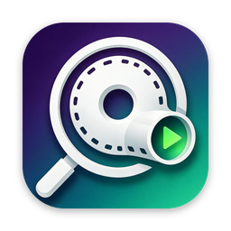
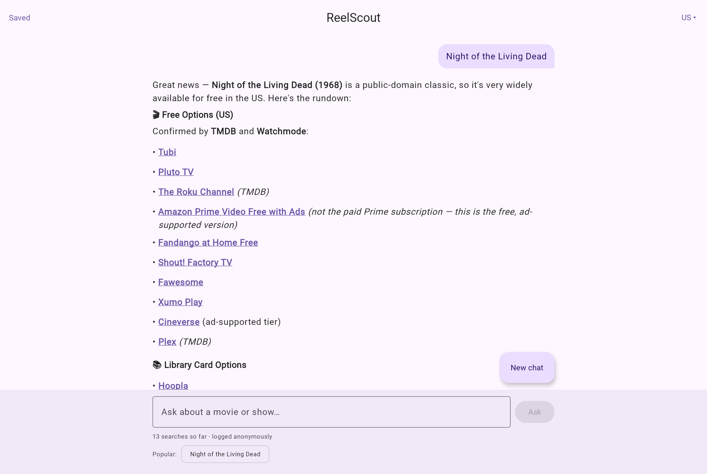
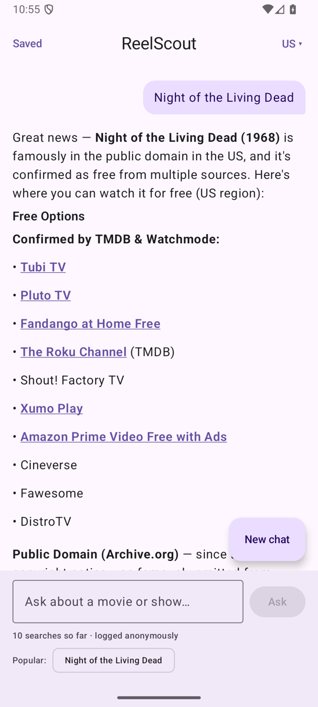
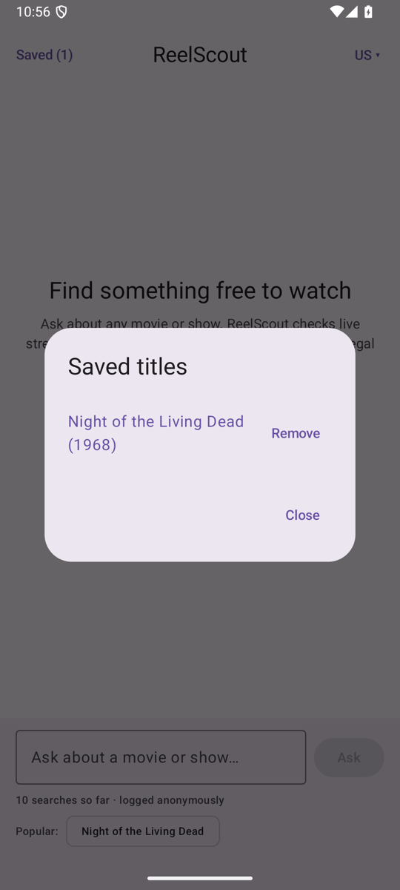
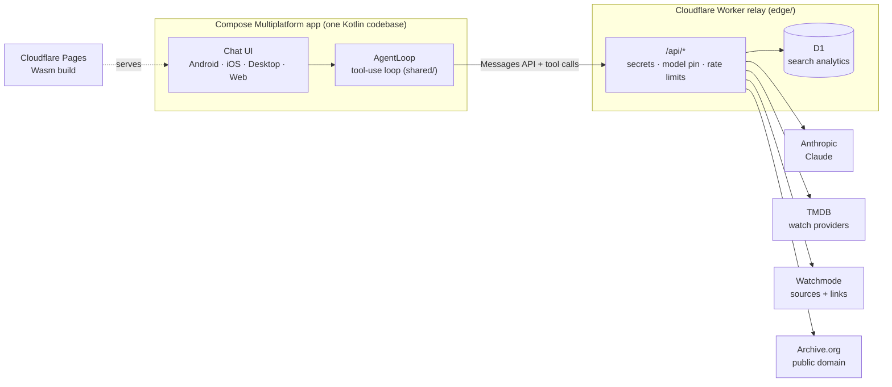

# ReelScout

**An AI agent that finds where to watch any movie or show for free, legally, on Android, iOS,
desktop and the web, from one Kotlin codebase.**

### ▶ Try it live: **[reelscout.bitterinfantproductions.com](https://reelscout.bitterinfantproductions.com)**

[](https://github.com/matthewthies73/ReelScout/actions/workflows/ci.yml)
[](https://github.com/matthewthies73/ReelScout/actions/workflows/ios.yml)
[](https://github.com/matthewthies73/ReelScout/actions/workflows/deploy-web.yml)
[](https://github.com/matthewthies73/ReelScout/actions/workflows/deploy-worker.yml)

<p>
  
</p>
<p>
  
  &nbsp;
  
</p>

Ask about a title, *"Night of the Living Dead"* or *"sci-fi like Interstellar I can watch free"*,
and ReelScout's agent looks it up in live catalog data, checks where it's streaming in your
country, falls back to public-domain archives for older films, and answers with direct
links. It never answers from the model's memory of "what's on Netflix", which goes stale
the day it's written.

## Highlights

- **A real agent, not a prompt wrapper.** Claude runs a multi-step tool-use loop: resolve
  the title, cross-check two availability sources, fall back to Archive.org, then
  answer, citing which source confirmed each option.
- **One codebase, four platforms.** Compose Multiplatform UI and shared Kotlin logic,
  including the agent loop itself, on Android, iOS, desktop (JVM) and web (Kotlin/Wasm).
- **Legal sources only.** TMDB (JustWatch data), Watchmode and Archive.org through their
  official APIs. No scraping, no torrents.
- **Honest about "free".** Ad-supported services, library-card services (Hoopla, Kanopy)
  and paid tiers are reported separately, never mixed together.
- **15 countries**, follow-up questions ("what about the 1990 remake?"), saved titles,
  and a live search counter with the week's most-asked questions.
- **Production-shaped.** A locked-down edge relay, CI on every PR (including an iOS build),
  and automated deploys with post-deploy smoke tests.

## How it works



1. The app sends the question, conversation history and four tool definitions to Claude,
   through the relay.
2. Claude asks for tools. `AgentLoop` runs them against the live APIs (`search_titles`,
   `get_watch_providers`, `get_watchmode_sources`, `search_public_domain`) and sends back
   the results, trimmed to what matters.
3. This repeats until Claude has enough to answer. The answer is rendered as Markdown with
   named links, and the titles it covered can be saved.

The Worker is the only backend. It holds the API keys and forwards requests. The agent's
reasoning happens in the app.

## Design decisions

| Decision | Why |
|---|---|
| **Agent loop runs in the app, in shared Kotlin** | It's written once and runs on all four platforms. The server stays a small, stable relay with no business logic. |
| **Messages API over Ktor, not the Anthropic Java SDK** | The Java SDK is JVM-only, which rules out iOS and Wasm. Implementing the tool-use protocol directly keeps the agent truly multiplatform. |
| **Relay pins the model and caps output** | Clients can't pick a pricier model or unbounded output on the project's key. Upstream paths are allowlisted, each IP is rate-limited, and CORS is restricted to the site. |
| **Tool results are trimmed before Claude sees them** | TMDB returns every country (about 140K characters). The tool sends only the user's country (about 2K), which cuts input tokens by around 98% per lookup. |
| **Free vs. library card vs. paid, decided in code** | Both data sources list library services as "free". A deterministic rule splits them out, rather than trusting the prompt. |
| **Analytics recorded by the relay** | Every answered question (question, answer, tools used, country) goes to D1 with no IP or user id. Clients can't inflate the counts. The public "popular" list only shows short, repeated questions. |
| **Versioned web loader** | Kotlin/Wasm's loader keeps one filename across builds, and the CDN cached it for 4 hours. `index.html` loads it as `reelscout.js?v=<content hash>`, so every deploy reaches visitors immediately. |
| **Settings store over a database for favorites** | A short list of saved titles doesn't need SQL, and SQLDelight on Wasm would mean async queries and a web-worker SQLite. |

## Tech stack

| | |
|---|---|
| **App** | Kotlin 2.3 · Compose Multiplatform 1.12 (Material 3) · Ktor 3 · kotlinx.serialization · Koin · multiplatform-settings · Markdown renderer |
| **Targets** | Android (AGP 9) · iOS (Xcode) · Desktop (JVM) · Web (Kotlin/Wasm) |
| **AI** | Anthropic Messages API, Claude Sonnet 5, with a hand-written tool-use loop |
| **Backend** | Cloudflare Workers (TypeScript) · D1 · Pages · Rate Limiting |
| **Data** | TMDB · Watchmode · Archive.org |
| **CI/CD** | GitHub Actions: build and test, iOS build on macOS, deploy Worker and web with smoke tests |

## Project layout

```
shared/       Agent loop, tool definitions, Anthropic client, TMDB/Watchmode/Archive.org
              repositories, domain models (commonMain + per-platform HTTP engines)
composeApp/   Compose Multiplatform UI: chat screen, favorites, region picker
              (commonMain + androidMain / iosMain / desktopMain / wasmJsMain)
androidApp/   Android application module
iosApp/       Xcode project hosting the composeApp framework
edge/         Cloudflare Worker relay + D1 analytics (TypeScript, migrations, tests)
```

## Running it locally

Requires JDK 17+. Builds point at the live relay by default, so no API keys are needed to
run the app.

```bash
./gradlew :composeApp:run                              # Desktop
./gradlew :androidApp:assembleDebug                    # Android APK
./gradlew :composeApp:wasmJsBrowserDevelopmentRun      # Web, http://localhost:8080
open iosApp/iosApp.xcodeproj                           # iOS: run in the simulator
```

## Tests

```bash
./gradlew :shared:desktopTest     # agent loop, tools, serialization (Ktor MockEngine)
cd edge && npm test               # relay analytics
```

The agent-loop tests replay canned Claude responses against a mocked relay. They cover
tool round-trips (including thinking blocks), conversation history, retries on overload,
rate limits, refusals, region handling and the titles each answer covers.

## Running your own relay

```bash
cd edge && npm install
npx wrangler secret put ANTHROPIC_API_KEY
npx wrangler secret put TMDB_API_KEY
npx wrangler secret put WATCHMODE_API_KEY
npx wrangler d1 create reelscout-analytics        # then set database_id in wrangler.toml
npx wrangler d1 migrations apply reelscout-analytics --remote
npm run deploy
```

Then point `EdgeApiConfig.baseUrl` (`shared/.../data/EdgeApiClient.kt`) at your Worker,
and add your site's origin to `ALLOWED_ORIGINS` in `edge/src/index.ts`. CI deploys
need `CLOUDFLARE_API_TOKEN` and `CLOUDFLARE_ACCOUNT_ID` repository secrets.

## Privacy

Each answered question is logged, anonymously, to improve the app. The log holds the
question, the answer, the tools used and the country. It stores no IP address, device or
account. Only the total count and the week's most-asked short questions are public.

## Status

| Phase | |
|---|---|
| 0–4 · Scaffold, data layer, relay, CI/CD, agent loop | ✅ Done |
| 5 · Region picker, free-source rules, favorites | ✅ Done |
| 6 · Packaging: Android release (Google Play + GitHub Releases), desktop installers | 🚧 In progress |
| 7 · Portfolio polish: demo videos per platform | Planned |

Architecture notes and the full build plan are in [ROADMAP.md](./ROADMAP.md).

## License

[MIT](./LICENSE)
